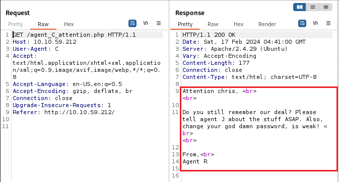
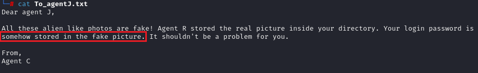
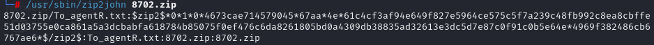
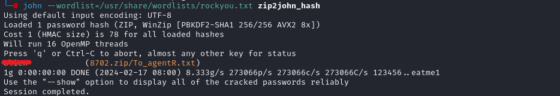
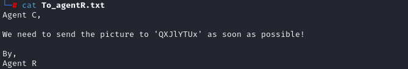
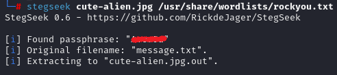
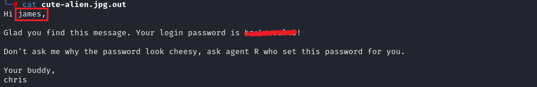
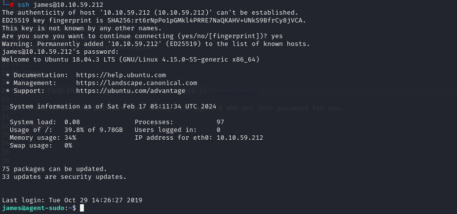
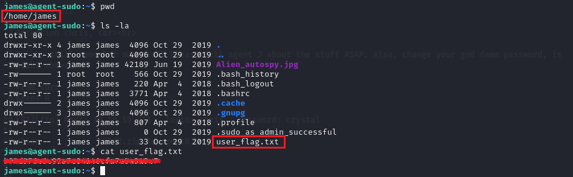
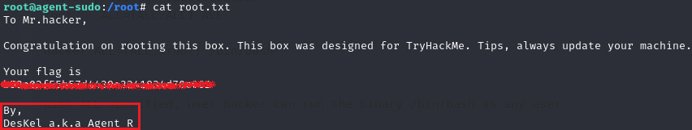

**Challenge description:** This challenge is a bit tricky and tests your knowledge of enumerating network protocols such as HTTP, FTP and SSH, conducting network-based password dictionary attacks using tools such as **Hydra**, using steganography tools and techniques such as **Binwalk**, **Stegseek**, cracking passwords of ZIP files using the well-known **JohnTheRipper** tool, and escalating your privileges on the target system by exploiting the vulnerable sudo version (CVE-2019-14287).

**Challenge category:** Network Security - Password Dictionary Attack - Steganography - Privilege Escalation.

**Challenge link:** [Agent Sudo](https://tryhackme.com/room/agentsudoctf)

<br/>

# Information Gathering

To find the open ports and the services exposed on the target system, we need to enumerate the provided `Target_IP` using **Nmap**.

## Nmap Scan


From the above output, we can find that ports **21**, **22**, and **80** are open. These are the well-known ports for **FTP**, **SSH**, and **HTTP** services respectively.

<br/>

# Task 1: How many open ports?

From the Nmap scan, the answer is `3` ports.

<br>

# Enumerating the HTTP Service


When we open the website using our browser at the home page there's a message says: _"Use your own codename as user-agent to access the site."_ So it means that to access the hidden page or the site we need to change the HTTP user-agent header field.

Well! But what is the codename we should use?!

Actually, it's obvious that the codenames used here are the first letter of the agents' names like: "Agent R". So let's figure out the codename we should use.

Well! The following is the normal response we got from the server when we use the default User-Agent:


Let's change the User-Agent and set it to "R" for instance:


Alright! After changing the User-Agent and use the codename "R" we got the above response.

From the above response, we figured out that there are 25 empolyees and for sure our target agent is one of them.

After trying some Capital letters, we figured out that the target agent codename is the capital letter "C":


After following the redirections:



Well done! From the specially crafted HTTP Response, we got the agent name `Chris` and also we figured out that his password is weak! That's great!

<br>

# Task 2: How you redirect yourself to a secret page?

We redirected ourselves to the secret page through changing the user-agent, so the answer is `user-agent`.

<br>

# Task 3: What is the agent name?

The agent name is `chris`.

<br>

# Conducting Password Dictionary Attack using Hydra

To get the FTP password of user `chris` we need to use **Hydra** to retrieve the password by conducting a password dictionary attack. We used the following command to do so:

```console
$ hydra -l chris -P /usr/share/wordlists/rockyou.txt ftp://10.10.59.212
```


Well done! **Hydra** has successfully found a valid password for the user `chris`!

<br>

# Task 4: FTP password

Follow the previous section to find the answer.

<br>

# Enumerating the FTP Service

Well! Now we have valid credentials we could use to access the FTP server, so let's do so:


After logging to the FTP server and listing the shared files, let's download the shared files to further investigate them.


## To_agent_J.txt



Fine! From this sentnce, we can find out that one of the downloaded pictures is the one that contains hidden data and the login password of `agent J`. This means that steganography techniques have been used!

<br>

# Steganography

## Binwalk cutie.png

To find out if the picture _"cutie.png"_ contains hidden data, we used the **Binwalk** tool with the following command:

```console
$ binwalk cutie.png
```


Alright! we were true, the _"cutie.png"_ file contains a hidde zip file.

So to extract the hidden data from the fake picture "cutie.png", we used the **Binwalk** tool with the following command:

```console
$ binwalk -e cutie.png --run-as=root
```


**Listing the extracted content by Binwalk:**


<br>

# Task 5: Zip file password

Well! To `unzip` the _"8702.zip"_ file we need to retrieve or crack the password of the ZIP file. To do so, we can use the well-known **JohnTheRipper** tool to crack the password.

To use **JTR** to crack the ZIP file password, we need to make it in a format that **JTR** can handle, so we will use a Python script called `zip2john` that helps us do so.

You can find zip2john on Kali Linux at the following path: `/usr/sbin/zip2john`

The output of `/usr/sbin/zip2john 8702.zip` looks like the following:



But we are gonna redirect the output to a txt file to use it later with **JTR**

```console
$ /usr/sbin/zip2john 8702.zip > zip2john_hash
```

<br>

Great! Now it's time to crack the hash using **JohnTheRipper**, we did so using the following command:

```console
$ john --wordlist=/usr/share/wordlists/rockyou.txt zip2john_hash
```



By following the above steps, you can retrieve the Zip file password and submit the answer on THM.

<br>

## Unzipping the Zip file

To unzip the "8702.zip" file, we used the following command:

```console
$ 7z x 8702.zip -p[Reducted_Password]
```


Now let's read the retrieved _"To_agentR.txt"_



<br>

# Task 6: steg password

To retrieve the steg password which is used to protect the hidden data in the _"cute-alien.jpg"_ picture, we are gonna use a tool called **Stegseek** which is _"a lightning fast steghide cracker that can be used to extract hidden data from files."_ So let's use it to retrieve the steg password.

```console
$ stegseek cute-alien.jpg /usr/share/wordlists/rockyou.txt
```



Well done! we have successfully retrieved the steg password. Now let's read the secret _"message.txt"_ file.

## cute-alien.jpg.out



<br>

# Task 7: Who is the other agent (in full name)?

From the retrieved _"cute-alien.jpg.out"_ file, the answer is `james`.

<br>

# Task 8: SSH password

From the retrieved _"cute-alien.jpg.out"_ file, you can also retrieve the SSH password **;)**

<br>

## SSH to the target machine as user `james`

Using the obtained credentials, let's SSH to the target machine:



<br>

# Task 9: What is the user flag?

To retrieve the user flag, you can easily find it under the home's directory of user `james`



<br>

# Task 10: What is the incident of the photo called?

To figure out the name of the incident, we used Google and the question hint "Reverse image and Foxnews" and found the following article at Foxnews:


So the answer is: `Roswell alien autopsy`

<br>

# Privilege Escalation

As the name of the room is `Agent-Sudo` it's a good starting to think of `sudo` as the possible privilege escalation attack vector.

So we first listed the command we can run as root user through the `sudo` command:


Then we detected the sudo version using `sudo -V` command:


The sudo version is `1.8.21p2`.

<br>

# Task 11: CVE number for the escalation 

After figuring out the sudo version, we tried to search for a known CVE related to it or any vulnerability and we found that the `1.8.21p2` sudo version is vulnerable and has the following CVE number: `CVE-2019-14287`.

To exploit the vulnerability and escalate our privileges to ROOT, we used the following command:

```console
$ sudo -u#-1 /bin/bash
```


And finally, we ROOTed the machine!

<br>

# Task 12: What is the root flag?

To read the root flag, we just traversed to the `/root` directory and then read the root.txt, that's it!




<br>

# Task 13: (Bonus) Who is Agent R?

From the _"root.txt"_ file, the Agent R is `DesKel`.

<br>

# Conclusion

In conclusion, I hope this walkthrough has been informative and shed light on our thought processes, strategies, and the techniques used to tackle each task. CTFs are not just about competition; they're about learning, challenging yourself and your knowledge, and getting hands-on experience through applying your theoretical knowledge.