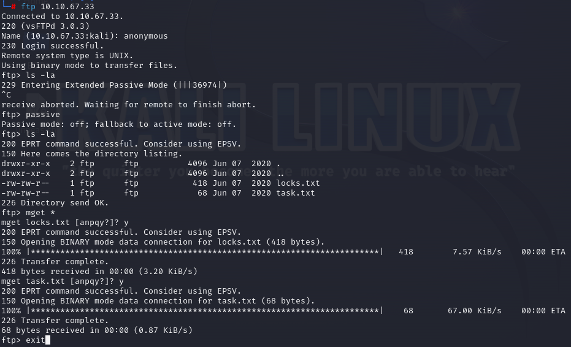
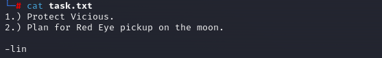
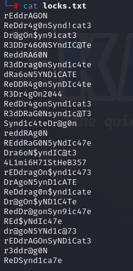
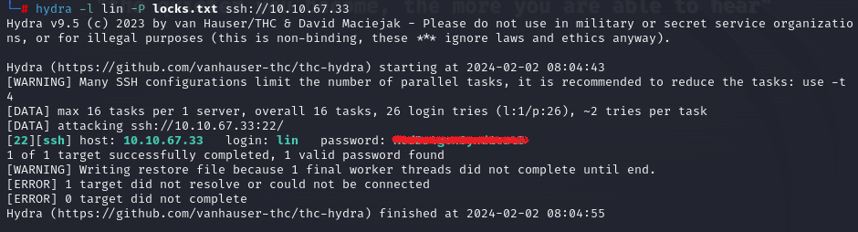
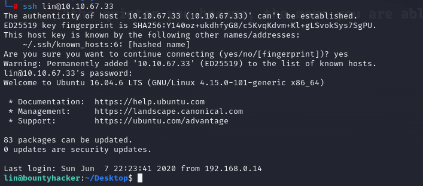
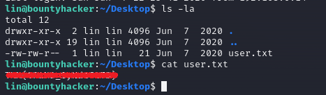
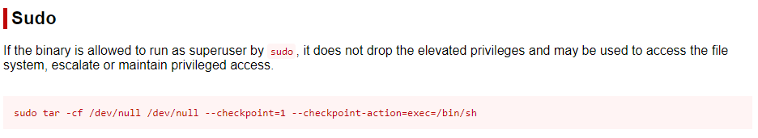
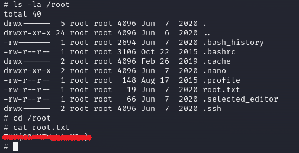

**Challenge description:** This challenge tests your knowledge of enumerating network protocols such as FTP and SSH, conducting network-based password dictionary attacks using tools such as **Hydra**, and escalating your privileges on the target system.

**Challenge category:** Network Security - Password Dictionary Attack - Privilege Escalation.

**Challenge link:** [Bounty Hacker](https://tryhackme.com/room/cowboyhacker)

<br/>

# Information Gathering

To find the open ports and the services exposed on the target system, we need to enumerate the provided `Target_IP` using **Nmap**.

## Nmap Scan


From the above output, we can find that ports **21**, **22**, and **80** are open. These are the well-known ports for FTP, SSH, and HTTP services respectively.

<br/>

## Enumerating the FTP Service

From the **Nmap** scan results, we figured out that the **FTP** service allows anonymous login. So let's connect to the FTP server to enumerate it.



Well! So as you can see from the above snapshot, we accessed the FTP server as `anonymous` without any password. After that, we listed the current FTP directory, and then we found two text files, so we downloaded them to our local machine to read them.

### task.txt



Good! There's a name on the _task.txt_ file, this may come in handy later.


### locks.txt



Interesting! Now after finding a name on _task.txt_, there's _locks.txt_ which looks like a password wordlist!

<br/>

# Task 1: Who wrote the task list? 

From _task.txt_ we can say that the answer is `lin`.

<br/>

# Conducting Password Dictionary Attack using Hydra

Well! We have a username `lin` and a password wordlist and the next task says: _"
What service can you bruteforce with the text file found?"_

So let's run **Hydra** using the following command to conduct our attack:

```console
$ hydra -l lin -P locks.txt ssh://<target_IP>
```



Well done! **Hydra** has successfully found a valid password for the user `lin`!

Now we can SSH to the target system using the found credentials.



<br/>

# Task 2: What service can you bruteforce with the text file found?

The answer is `SSH`.

<br/>

# Task 3: What is the user's password? 

After conducting the password dictionary attack yourself using **Hydra**, you will find it out ;)

<br/>

# Task 4: user.txt

After SSH to the target system, we just listed the current directory content, and we found the _user.txt_ file.



<br/>

# Root Privilege Escalation

To get the root flag, we need to escalate our privileges on the system. So to escalate our privileges we did the following: 

1. We listed the commands our current user can run as root (sudoer)


2. Open the well-known **GTFOBins** and search for `tar` to find a methodology to ROOT the machine
   


3. Run the found command on **GTFOBins** and get ROOT


<br/>

# Task 5: root.txt

To read the root flag, we just traversed to the `/root` directory and then read the root.txt, that's it!



</br>

# Conclusion

In conclusion, I hope this walkthrough has been informative and shed light on our thought processes, strategies, and the techniques used to tackle each task. CTFs are not just about competition; they're about learning, challenging yourself and your knowledge, and getting hands-on experience through applying your theoretical knowledge.