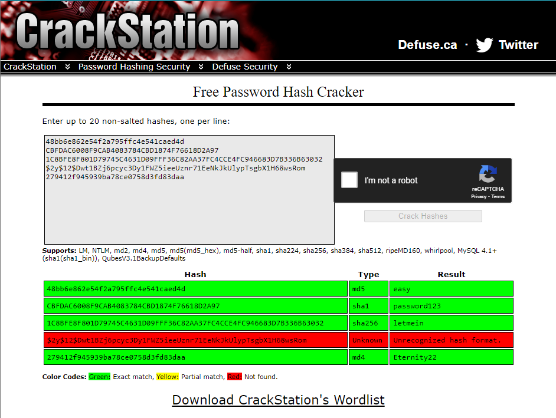
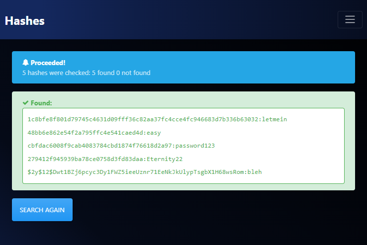

**Challenge description:** This challenge tests your knowledge of identifying and analyzing password hashes, cracking password hashes using online tools, conducting password-dictionary attacks using tools such as Hashcat and John The Ripper.

**Challenge category:** Cryptography - Password Cracking - Password Dictionary Attacks

**Challenge link:** [Crack the hash](https://tryhackme.com/room/crackthehash)

<br>

# Introduction

Mastering the craft of conducting password cracking attacks with diverse tools and techniques is a paramount skill for every penetration tester. Beyond mere unauthorized access, this proficiency is a linchpin in understanding and fortifying digital security. It serves as a crucial dimension of a penetration tester's toolkit, allowing them to uncover vulnerabilities within systems, assess the robustness of cryptographic defenses, and ultimately enhance the overall resilience of an organization's cybersecurity posture. In the dynamic landscape of cyber threats, the ability to proficiently navigate and decrypt passwords is not just a tactical advantage but a strategic imperative, reinforcing the pentester's capability to identify and mitigate potential points of exploitation. So delve into this challenges questions together!

<br>

# Online Hash Cracking Tools

When it comes to cracking password hashes in the hope of retrieving the password value of the hash, it's a good practice to start by making use of **online hash cracking tools** as these tools have massive pre-computed lookup tables to crack password hashes and it's more likely to find the hash value, if it's there, in less than a second, on the other hand, using tools like **Hashcat** or **John The Ripper** to crack the password hash using brute-force attacks or even password-dictionary attacks may take longer.

<br>

# Task 1: Level 1 Hashes

As we said above, it's a good practice to first look for the hash values on online hash cracking tools or databases, let's try to crack the hash values in Task 1.

There are a lot of online hash-cracking tools out there we can use, but to name a few, the following websites are some of the most popular ones:

- https://crackstation.net/
- https://hashes.com/en/decrypt/hash
- https://md5hashing.net/
- https://www.onlinehashcrack.com/

Throughout this writeup, we are gonna use https://crackstation.net/ and https://hashes.com/en/decrypt/hash.

Well let's open them then copy and paste all the hash values in task 1, but make sure to write one hash per line.





Well done! As you see, we retrieved all the passwords by using online hash cracking tools! You may also have noticed that CrackStation could not retrieve the password of the hash number 4, but we were able to retrieve it using hashes.com. So keep in mind to try different tools.

<br>

# Task 2: Level 2 Hashes

In task 2 we will not use online hash cracking tools just to get familiar with the manual process of cracking hashes and start using tools such as **Hash-Identifier** to identify hash type and **Hashcat** to conduct password-dictionary attack. So let's get started!

**The following are the steps we will follow to find the password from its hash value using Hashcat:**

1. Identify the hash type using tools such as Hash-Identifier, Hashid, or any online hash identifier tool
2. Find the corresponding Hashcat "Hash-Mode" value from the following website "https://hashcat.net/wiki/doku.php?id=example_hashes" to use it when running **Hashcat**
3. Save the hash value in a text file
4. Run **Hashcat** to conduct a password-dictionary attack

So keep these steps in mind as we will keep using them till the end of this writeup!

<br>

## Level 2 - Hash 1

1. Identifying the hash using **Hash-Identifier** tool


2. Finding the "Hash-Mode" value
   
   From the following website "https://hashcat.net/wiki/doku.php?id=example_hashes", the value is `1400`

3. Saving the hash value in a text file using the following command:

```console
$ echo -n 'F09EDCB1FCEFC6DFB23DC3505A882655FF77375ED8AA2D1C13F640FCCC2D0C85' > hash.txt
```

4. Running **Hashcat** using the following command:

```console
$ hashcat -m 1400 -d 1 hash.txt /usr/share/wordlists/rockyou.txt
```


<br>

## Level 2 - Hash 2

1. Identifying the hash using https://hashes.com/en/tools/hash_identifier


2. Finding the "Hash-Mode" value
   
   From the following website "https://hashcat.net/wiki/doku.php?id=example_hashes", the value is `1000`

3. Saving the hash value in a text file using the following command:

```console
$ echo -n '1DFECA0C002AE40B8619ECF94819CC1B' > hash.txt
```

4. Running **Hashcat** using the following command:

```console
$ hashcat -m 1000 -d 1 hash.txt /usr/share/wordlists/rockyou.txt
```


<br>

## Level 2 - Hash 3

1. Identifying the hash using https://hashes.com/en/tools/hash_identifier


2. Finding the "Hash-Mode" value
   
   From the following website "https://hashcat.net/wiki/doku.php?id=example_hashes", the value is `1800`

3. Saving the hash value in a text file using the following command:

```console
$ echo -n '$6$aReallyHardSalt$6WKUTqzq.UQQmrm0p/T7MPpMbGNnzXPMAXi4bJMl9be.cfi3/qxIf.hsGpS41BqMhSrHVXgMpdjS6xeKZAs02.' > hash.txt
```

4. Running **Hashcat** using the following command:

```console
$ hashcat -m 1800 -d 1 hash.txt /usr/share/wordlists/rockyou.txt
```


<br>

## Level 2 - Hash 4

1. Identifying the hash using **Hash-Identifier** tool


2. Finding the "Hash-Mode" value
   
   After trying different "Hash-Mode" values but in fail, we used the provided hint and after finding that the right hash type is _"HMAC-SHA1"_ then from the following website "https://hashcat.net/wiki/doku.php?id=example_hashes", the value is `160`

3. Saving the hash value with its salt _"tryhackme"_ in a text file using the following command:

```console
$ echo -n 'e5d8870e5bdd26602cab8dbe07a942c8669e56d6:tryhackme' > hash.txt
```

4. Running **Hashcat** using the following command:

```console
$ hashcat -m 160 -d 1 hash.txt /usr/share/wordlists/rockyou.txt
```


<br>

**Note:** the `-d 1` option in the hashcat command is to run **Hashcat** using our GPU as it's always faster than using the CPU, so if you have a powerful dedicated GPU use it instead of your CPU.

**Additional note:** If you face any problem using your GPU with **Hashcat**, check out the following video from Nvidia as it will help you a lot in solving this problem. https://www.youtube.com/watch?v=JaHVsZa2jTc&ab_channel=NVIDIADeveloper

<br>

# Conclusion

In conclusion, I hope this walkthrough has been informative and shed light on our thought processes, strategies, and the techniques used to tackle each task. CTFs are not just about competition; they're about learning, challenging yourself and your knowledge, and getting hands-on experience through applying your theoretical knowledge.