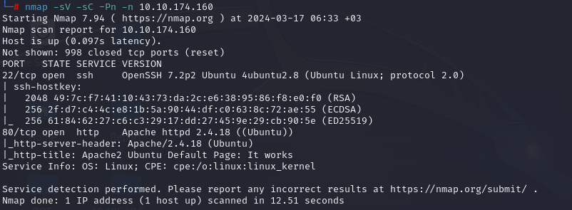
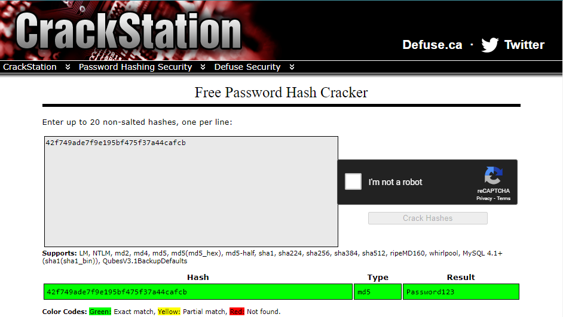
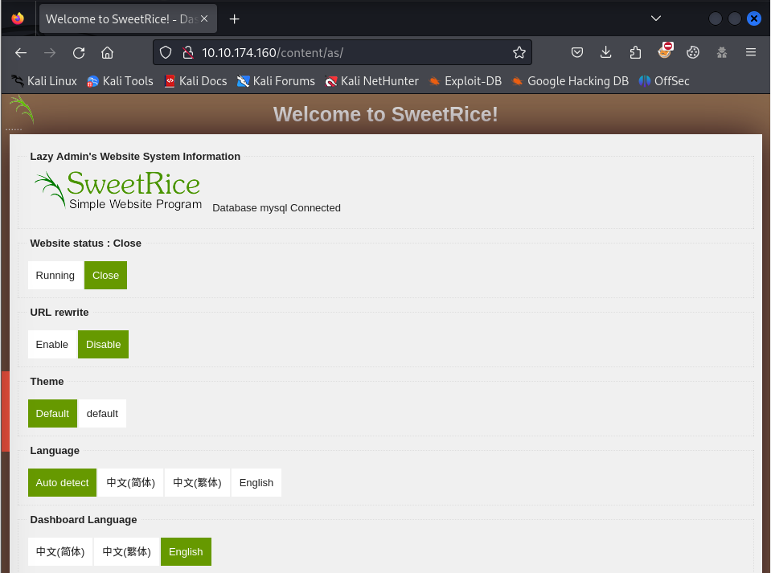
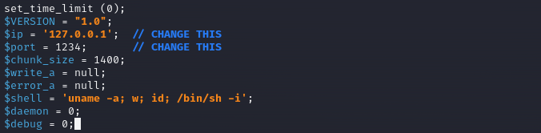
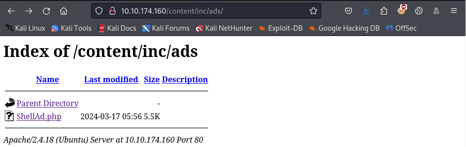
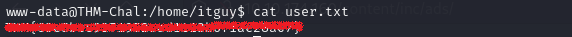
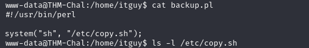
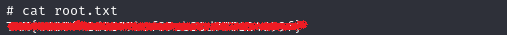

**Challenge description:** This easy challenge tests your knowledge of basic web enumeration techniques, exploiting file upload vulnerabilities, and privilege escalation techniques. 

**Challenge category:** Web Exploitation - Privilege Escalation.

**Challenge link:** [Lazy Admin](https://tryhackme.com/r/room/lazyadmin)

<br>

# Reconnaissance & Information Gathering

## Nmap Scan

The first step for us here is to enumerate the running services on the target system before doing anything.

So to find the services exposed we need to enumerate the provided `Target_IP` using **Nmap**.



From the above output, we can find that ports **22**, **80** are open. These are the well-known ports for SSH and HTTP services respectively.

<br>

## Enumerating the Web Server

From the Nmap scan result we can see that the target system is running a web server on port **80**, so let's open our browser and take a look at the web app.


From the above snapshot, we can see that the home page is just the default page for the Apache2 web server. So, nothing is interesting on this page. However, we still have to enumerate the sub-directories and files of the website, so let's do so.

<br>

## Directory Enumeration using Gobuster 

When we open the running web application we can see just the default Apache server page without anything useful.

To enumerate sub-directories and files you can use tools like **dirbuster**, **dirb**, **gobuster**, or even **burpsuite** but for now, we will use **gobuster**.


Well! We have found a hidden sub-directory named `/content` so let's run **gobuster** again but at this time to enumerate sub-directories and files of the `/content` sub-directory.


Alright! It looks like the running web application hide aloooot!

<br>

### Content Directory


Nice! Now we can say that there's a real website hosted on the Apache web server. And the more interesting thing is that it's a Content Management System (CMS). CMSs are well-known for having vulnerable versions, the use of vulnerable plugins, and insecure code.

<br>


### SweetRice Login Page

By navigating to the sub-directories found by **gobuster**, the `/content/as` directory is a login page to the SweetRice CMS dashboard.


<br>

### MySQL Backup File

By further investigating the found directory lists, from the `/content/inc` directory list we found a very intersting directory named `mysql_backup`, interesting!


<br>

## Admin Credentials Dumping

After downloading the MySQL backup file, we took a look at the content of the file and we found interesting information! The backup file contains the credentials of the CMS admin account.


Now we have the username and the password hash of the admin account. It's time to retrieve the password value itself from the hash value to be able to login to the dashboard.

<br>

## Hash Cracking

To retrieve the password value, we used the well-known **Crackstation** online tool.

You can access it from the following link: https://crackstation.net/



Well done! **Crackstation** was able to retrieve the password value, so let's use the found credentials to login to the dashboard.



<br>

# Exploiting File Upload Vulnerability

After login to the SweetRice dashboard, we figured out that the running version is `1.5.1` and after searching for known vulnerabilities related to this version, we have found that it's vulnerable to _File Upload Vulnerability_.

There are many ways to exploit this vulnerability, there are even available public exploit codes we can use. Neverthless, we found that it's better to exploit it manually! So let's see how to do so.

Most commonly, the goal of exploiting a file upload vulnerability is to upload a reverse shell to access the remote web server.

So to get a reverse shell on the system, we are gonna use the well-known `php-reverse-shell` payload by **Pentest Monkey**. To use it, you can find it in your Kali Linux machine under the `/usr/share/webshells/php` directory named `php-reverse-shell.php` or you can download it from the following link: https://pentestmonkey.net/tools/web-shells/php-reverse-shell

Well! Now, before uploading the reverse shell to the web server, you need to open the source code file with your favorite text editor and change the found IP address with your TryHackMe IP address to be able to get the reverse shell in the following steps.



Alright! Now copy the reverse shell script -> then navigate to the `Ads` section on the dashboard -> then paste the script on it -> and click done.


Now our shell script has been uploaded to the web sever at the following path: `/content/inc/ads`



### Setup Netcat Listener

To catch our reverse shell we have to start listening on the specified port at the `php-reverse-shell.php` file. Use the following command to set **Netcat** listener:

```console
$ nc -nlp <specified_port>
```

### Fireup our reverse shell


Finally! We have got our shell on the target system.

<br>

# Task 1: What is the user flag?

To retrieve the user flag, we navigated to the user `itguy` home directory `/home/itguy`.



<br>

# Root Privilege Escalation

To get the root flag, we need to escalate our privileges on the system. So to escalate our privileges we did the following: 

1. We listed the commands our current user can run as root (sudoer)


2. Read the `/home/itguy/backup.pl` file to understand how does it work
   


From the above snapshot, we can see that the perl script is just execute the shell script at `/etc/copy.sh`, so if we can modify it, we can exploit it to escalate our privileges.

3. Check the file permissions of the `/etc/copy.sh` script


From the above snapshot, we can see that the script is owned by the root user but we can modify it as we have write permessions!

4. Modify the `/etc/copy.sh` script to get root shell


1. Setup **Netcat** Listener

```console
$ nc -nlp <specified_port>
```

6. Execute the sudo command

```console
$ sudo /usr/bin/perl /home/itguy/backup.pl
```

7. We are now **ROOT**


<br>

# Task 2: What is the root flag?

To read the root flag, we just traversed to the `/root` directory and then read the root.txt, that's it!



<br>

# Conclusion

In conclusion, I hope this walkthrough has been informative and shed light on our thought processes, strategies, and the techniques used to tackle each task. CTFs are not just about competition; they're about learning, challenging yourself and your knowledge, and getting hands-on experience through applying your theoretical knowledge.