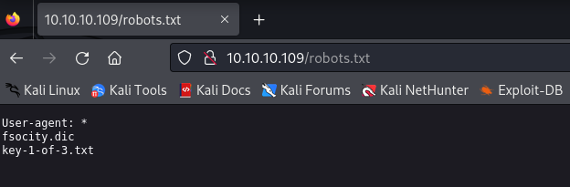
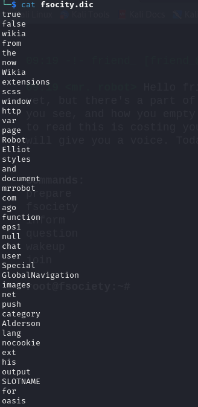
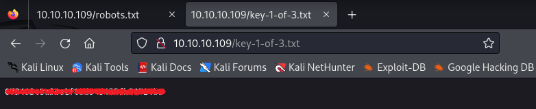
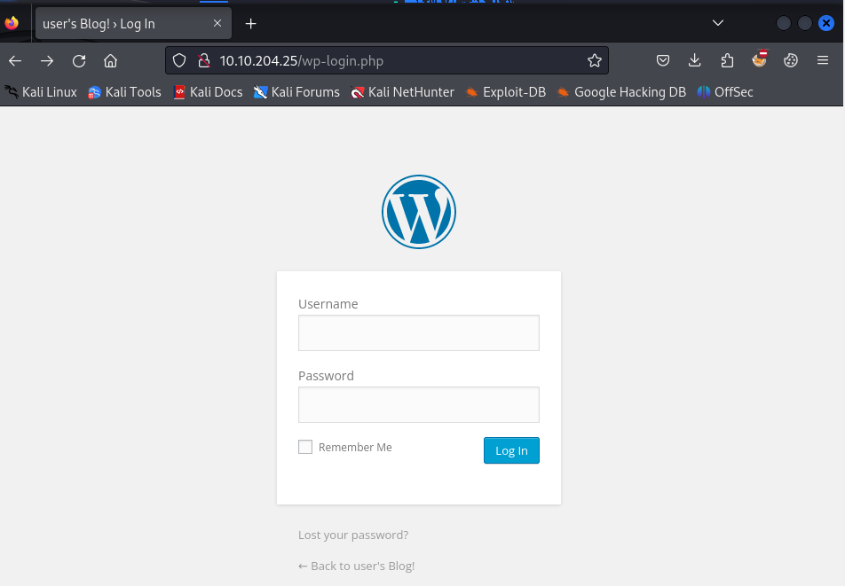
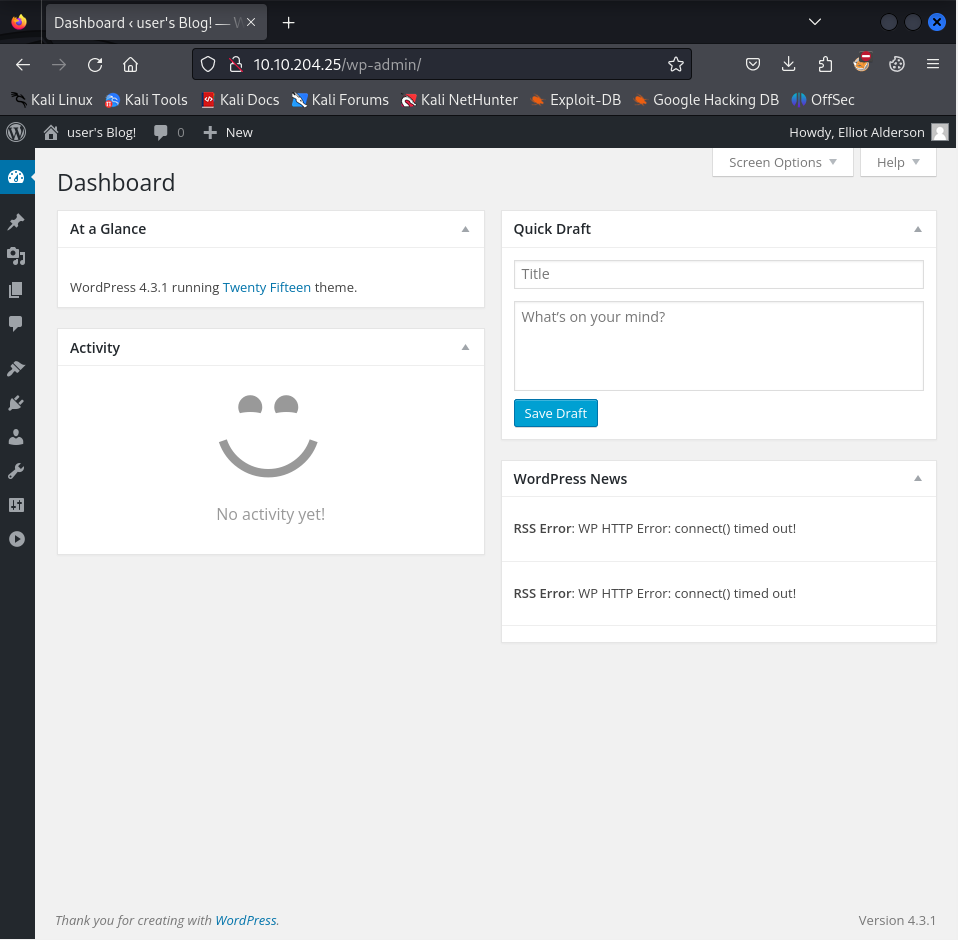
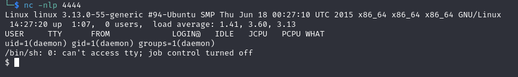
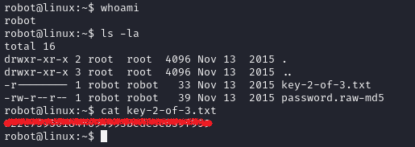
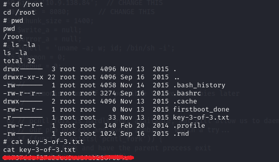

**Challenge description:** This challenge tests your knowledge of basic web enumeration techniques, conducting username and password dictionary attacks, exploiting WordPress file upload vulnerabilities, and privilege escalation techniques. 

**Challenge category:** Web Exploitation - Password Cracking - Privilege Escalation.

**Challenge link:** [Mr. Robot](https://tryhackme.com/room/mrrobot)

<br/>


# Information Gathering

## Nmap Scan

The first step for us here is to enumerate the running services on the target system before doing anything.

So to find the services exposed we need to enumerate the provided `Target_IP` using **Nmap**.


From the above output, we can find that port **80** is open. This is the well-known port for HTTP web service.

<br/>

## Enumerating the Web Application

After figuring out the running services, let's take a look at the running web application using our browser.


Well! As the author of this room stated this room is _"Based on the Mr. Robot show, can you root this box?"_ So when we enumerated the web application manually and followed this nice gamification stuff, we just found nothing but these well-made videos and pictures from the Mr. Robot show.

So let's focus on our job and don't enter these rabbit holes!

<br/>

## Directory Enumeration using Gobuster 

To enumerate sub-directories and files you can use tools like **dirbuster**, **dirb**, **gobuster**, or even **burpsuite** but for now, we will use **gobuster**.


Alright! It seems that the web application has lots of sub-directories and files.

**Note:** When using **gobuster**, it's a good practice to enable the `-x` option to enumerate files with specific extensions, as **gobuster** may overlook files with extensions if we don't use this option. In our case we have used `-x txt,php,js,xml`.

So after taking a look at each sub-directory found by **gobuster**, it looks like the web application is built using WordPress.

From this long sub-directories list, we found the following come in handy: `wp-login.php`, `robots.txt`

## robots.txt file



Well done, looks like interesting! 

## fsocity.dic file

By navigating to the `/fsocity.dic` directory it is directly being downloaded to our system. So let's open it.



Interesting! **fsocity.dic** looks like a usernames or passwords wordlist, so keep it for now.

<br/>

# Task 1: What is key 1?

From the directories found on the `robots.txt` file, there's a file named `key-1-of-3.txt`. So by opening it, we retrieve the first key.



<br/>

# Conducting username and password dictionary attack using Hydra

## WordPress Login Page

So as we have mentioned one of the useful sub-directories we found from **gobuster** results is the `wp-login.php`. So let's navigate to it.



Well! Now we have a login page but we don't have a valid credentials to login with yet.

In such situations, there are many approaches we can use to bypass the login page. For example, by testing the login form for SQL Injection vulnerabilities, trying to login using default credentials, or conducting a username and password dictionary attack.

In our current situation, as we have a wordlist `fsocity.dic`, we are gonna use it to conduct our dictionary attack. To do so, we are gonna use the well-known **Hydra** tool.

## Username Dictionary Attack

As we don't have any valid username yet, we will use **Hydra** firstly to try to find a valid username. We used the following command to conduct our username dictionary attack:

```console
$ hydra -L fsocity.dic -p test <target_IP> http-post-form "/wp-login.php:log=^USER^&pwd=^PASS^:Invalid username"
```

`log=^USER^&pwd=^PASS^` are the POST request parameters submitted to the server to check the entered credentials. You can get them from the page source code or by intercepting the request using **Burp Porxy**.

`Invalid username` is the error message shown by the login page to indicate that the entered username is wrong. We have to give **Hydra** to differentiate wrong credentials from right ones.


Well done! We found a valid username `Elliot`. Now let's run **Hydra** again to conduct a password dictionary attack.

## Password Dictionary Attack

**Note:** The provided `fsocity.dic` wordlist has a lot of duplicated lines, so before we started the attack, we created a unique wordlist using the following command:

```console
$ sort -u fsocity.dic > fsocity-wordlst
```

Well! To start our password dictionary attack, we used the following command:

```console
$ hydra -l Elliot -P fsocity.dic <target_IP> http-post-form "/wp-login.php:log=^USER^&pwd=^PASS^:The password you entered for the username " -t 30 -I
```


So after entering the found username and password, we successfully logined to the WordPress Dashboard.



<br/>

# Exploiting WordPress File Upload Vulnerability

From the previous dashboard snapshot, we can tell that the running version is `4.3.1`. This version is vulnerable to Remote Code Execution (RCE) vulnerability via arbitrary file upload.

As we have access to the admin panel. We can access the `Themes Editor`. From this situation, we can leverage a reverse shell by exploiting this vulnerable WordPress version.

<br/>

**Step 1: From the left-side menu, go to → appearance → editor**

<br/>

**Step 2: Select 404 Template (404.php)**

<br/>

**Step 3: Prepare the reverse shell payload**

We are gonna use the well-known php-reverse-shell payload by Pentest Monkey. To use it, you can find it in your Kali Linux machine under the /usr/share/webshells/php directory named php-reverse-shell.php or you can download it from the following link: https://pentestmonkey.net/tools/web-shells/php-reverse-shell

Well! Now, before uploading the reverse shell to the web server, you need to open the source code file with your favorite text editor and change the found IP address with your TryHackMe IP address to be able to get the reverse shell in the following steps.


Alright! we are ready to go now and upload our shell.

<br/>

**Step 4: Edit content of 404.php template with our reverse shell code**

Now overwrite the content of 404.php with your php-reverse-shell.php payload content.

<br/>

**Step 5: Setup Netcat Listener**

To catch our reverse shell we have to start listening on the specified port at the `php-reverse-shell.php` file. Use the following command to set **Netcat** listener:

```console
$ nc -nlp <specified_port>
```
<br/>

**Step 6: Go to 404.php to activate the shell**

To fireup our reverse shell, we need to go to the edited 404.php template from the following link: `http://<target_IP>/wordpress/wp-content/themes/twentyfifteen/404.php`

<br/>

## Netcat Reverse Shell

Alright! After doing all the steps mentioned above, we should get a reverse shell like the following.



<br/>

## User "_robot_" Privilege Escalation 

So after getting our reverse shell, we enumerated the target system to find our keys _(flags)_ and we found the second key on the following directory `/home/robot/key-2-of-3.txt` but we don't have permission to access it as it belongs to the user named _robot_. Anyway, we also found an interesting file named "_password.raw-md5_".


Interesting this is more likely to be the password hash of user _robot_.

We used an online website called CrackStation to find the hash value of this password, also you can use the well-known **John The Ripper** tool to crack this hash.


Well! Know we can change our current user to the _robot_ user in order to retrieve the second key.


As you see, when we tried to change to user _robot_, the current shell gave us an error. So let's upgrade our shell to solve this problem.

<br/>

### Stabilizing nc shell using python

To stabilize our shell we used the following commands:

```console
$ python3 -c 'import pty; pty.spawn("/bin/bash")'
$ CTRL + Z
$ stty raw -echo; fg
# PRESS enter
$ export TERM=xterm-256color
```

<br/>

# Task 2: What is key 2?

By reading the `key-2-of-3.txt` file on the user's _robot_ home directory, we successfully retrieved the second key.



<br/>

## Root Privilege Escalation

To get the final key, we need to escalate our privileges to the _root_ user.

To escalate our privileges we exploited a misconfigured binary, specifically the **Nmap**.

To list the binaries with SUID permission enabled, we used the following command:

```console
$ find / -perm -4000 -type f 2>/dev/null
```


We used the well-known **GTFOBins** abd its provided commands and methodology to ROOT the machine and the methodology is as follows:


Wonderful! We have successfully escalated our privileges to the _root_ user.

<br/>

# Task 3: What is key 3?

By reading the `key-3-of-3.txt` file on the _root_ home directory, we successfully retrieved the third and final key.



</br>

# Conclusion

In conclusion, I hope this walkthrough has been informative and shed light on our thought processes, strategies, and the techniques used to tackle each task. CTFs are not just about competition; they're about learning, challenging yourself and your knowledge, and getting hands-on experience through applying your theoretical knowledge.