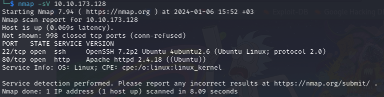
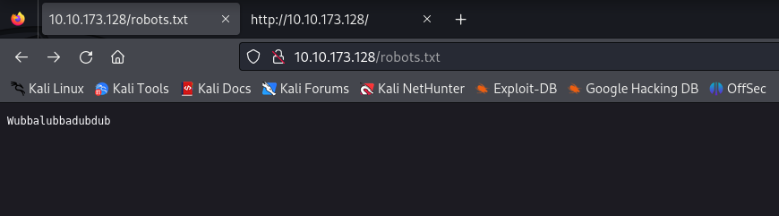
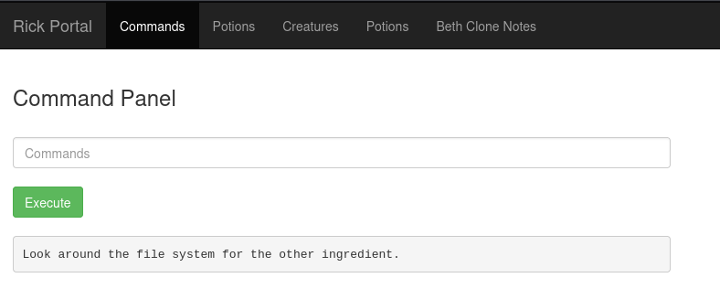
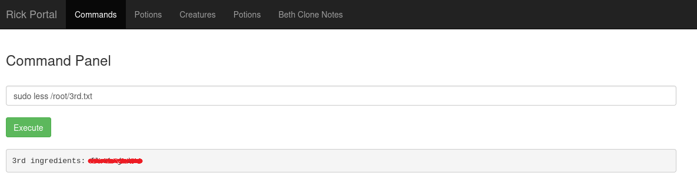

**Challenge description:** This challenge helps you apply basic web app footprinting techniques such as directory enumeration and page source code review, as well as exploiting a Remote Code Execution (RCE) vulnerability. 

**Challenge category:** Web Exploitation.

**Challenge link:** [Pickle Rick](https://tryhackme.com/room/picklerick)

<br/>

# Nmap Scan

The first step for us here is to enumerate the running services on the target system before doing anything.

So to find the services exposed we need to enumerate the provided `Target_IP` using **Nmap**.



From the above output, we can find that ports **22**, **80** are open. These are the well-known ports for SSH and HTTP services respectively.

<br/>

# Enumerating the Web Server

From the Nmap scan result we can see that the target system is running a web server on port **80**, so let's open our browser and take a look at the web app.


Well! It's just a simple web page with the Rick and Morty cartoon poster and also with a text paragraph that seems it have a hidden message from Morty asking for help!

Morty says: "I need you to **BURRRP**....Morty, logon to my computer and find the last three secret ingredients to finish my pickle-reverse potion."

Okay, Morty! I think from this sentence, we can figure out that maybe "**BURRRP**" refers to using the well-known Burpsuite tool as it may come in handy, and also from "logon to my computer and find the last three secret ingredients" I think that to finish this challenge we need to get a shell on the target system or at least somehow execute arbitrary code on the target system.

So let's also take a look at the page source code as it may reveal something useful for us!

_**Keep in mind:** When dealing with web apps it's so important to take a look at the page source code as it may reveal some secrets or anything helpful for us!_

<br/>

## Home Page Source Code View


Alright! There's a comment in the source code with a note containing a username!

Good! This is maybe a valid username credential to login with somewhere on the target system. So keep it on your notepad for now as we may use it later.

<br/>

## Directory Enumeration using Gobuster 

Well! As the home page looks empty, now it's a good idea to start enumerating the web app to find hidden sub-directories and files.

To enumerate sub-directories and files you can use tools like **dirbuster**, **dirb**, **gobuster**, or even **burpsuite** but for now, we will use **gobuster**.


After running **gobuster** for a while, we found this sub-directory named _"/assets"_ but after taking a look at it we found nothing useful.

So let's try running **gobuster** again but this time let's use "`-x php,js,txt`" to enumerate files with specific extensions.


Well! This time we got more interesting directories! Let's investigate them.

<br/>

### robots.txt file



It seems that the robots.txt doesn't contain its standard information of disallowed files or directories to be listed by the search engines, but instead, it has a gibberish word! Anyway, keep it also in your notepad.

<br/>

### Portal Login Page


Alright! We found a login page, and as you remember from the previous enumerations we found a username also we just found a gibberish word from the robots.txt file, so let's use it and try to login to the portal.

<br/>

### Rick Portal Panel


Great going! The credentials we found are valid!

Even the gibberish words may come in handy **:)**, so don't underestimate any finding.

<br/>

### Portal Panel Source Code Rabbit Hole


As we said checking the page source code is a good habit to build as a pentester, we checked the portal panel source code and we found a base64 string, so to decode it we can use our Linux terminal or we can **CyberChef** The Cyber Swiss Army Knife tool for encoding and decoding different data formats.


Bummer! It's just a rabbit hole _**:(**_

<br/>

# Task 1: What is the first ingredient that Rick needs?

Okay, as we see the Rick Portal Panel has a Command Panel which executes arbitrary code for us which is very dangerous to find!

So let's write the `ls` command and see the output.


Well done! It seems that we're in the `www` web server directory.

Trying to `cat` the _Sup3rS3cretPickl3Ingred.txt_ file, but it seems that the `cat` command has been disabled! anyway, we can use other commands to do the same like `less`, `more`, or much more. 

Let's read it with `less` command to retrieve task 1's flag.


<br/>

# Task 2: What is the second ingredient in Rick’s potion?

From the previous `ls` command result, there's a txt file named _clue.txt_

So let's read it with `less` command.



Fine! So as the clue stated looking around the file system may help us to find other ingredients, after listing some directories, we found a directory named _"/home/rick"_, and by listing its directory content we found a file named "second ingredients". Using the following command to read it and retrieve the second flag:

 ```console
 $ less "/home/rick/second ingredients"
 ``` 
 


<br/>

# Task 3: What is the last and final ingredient?

To solve this task, we tried different things and tried to traverse the file system and access different directories but with no useful info. So we checked our current privileges on the system and found that we're accessing the system as user _www-data_ the web server account. An important thing at this stage is to figure out your permissions and the commands you can run on the system.

<br/>

To do so, we used the `sudo -l` command to figure out the list of commands we can run as sudoer or with root privileges on the system and we found the following.


Oha! We almost root on the system! Our current user can run any command as root on the system. So by listing the _"/root"_ directory using the following command 

```console
$ sudo -la /root
``` 
we found a txt file named _"3rd.txt"_

<br/>


Reading it using the following command 

```console
$ sudo less /root/3rd.txt
```



</br>

# Conclusion

In conclusion, I hope this walkthrough has been informative and shed light on our thought processes, strategies, and the techniques used to tackle each task. CTFs are not just about competition; they're about learning, challenging yourself and your knowledge, and getting hands-on experience through applying your theoretical knowledge.

</br>

