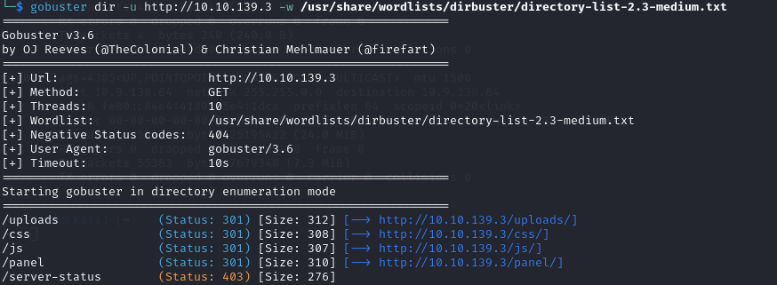
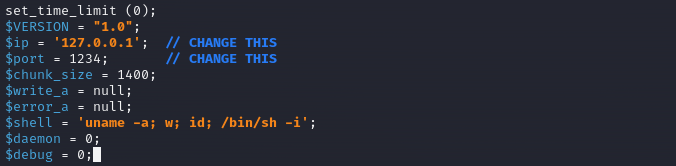
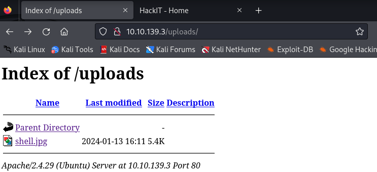

**Challenge description:** This easy challenge tests your knowledge of basic web enumeration techniques, exploiting file upload vulnerabilities, and privilege escalation techniques. 

**Challenge category:** Web Exploitation - Privilege Escalation.

**Challenge link:** [RootMe](https://tryhackme.com/room/rrootme)

<br/>

# Nmap Scan

The first step for us here is to enumerate the running services on the target system before doing anything.

So to find the services exposed we need to enumerate the provided `Target_IP` using **Nmap**.


From the above output, we can find that ports **22**, **80** are open. These are the well-known ports for SSH and HTTP services respectively.

<br/>

# Task 2: Reconnaissance

Throughout this task, we will rely on the **Nmap** results from the previous scan.

## Scan the machine, how many ports are open?

It's very obvious that the number of open ports is: `2`.

<br/>

## What version of Apache is running?

The running Apache version is `2.4.29`.

To detect the Apache server version we have used the **Nmap** `-sV` scan option, as this option helps us to detect the running service version.

<br/>

## What service is running on port 22?

From the Nmap scan results the service running on port `22` is `SSH`.

<br/>

## Directory Enumeration using Gobuster 

To enumerate sub-directories and files you can use tools like **dirbuster**, **dirb**, **gobuster**, or even **burpsuite** but for now, we will use **gobuster**.



<br/>

## What is the hidden directory?

As per the previous gobuster scan screenshot, we can figure out that the hidden directory is `/panel` directory.

<br/>

## _panel_ directory Content

Using our browser, we notice that the `/panel` directory is just a page to upload files from your machine to the web server.


Interesting! A hidden directory with file upload functionality, this page is likely to serve as an attack vector on the web server.

<br/>

# Task 3: Getting a shell

## File upload vulnerability

Well! To solve this task there's a serious web app vulnerability you need to be familiar with. This vulnerability is called **File upload vulnerability**.

It's common to find file upload functionalities in most web apps; As we interact with web apps to achieve many tasks, one of these tasks may be to upload your profile image, your CV, your document, or any other type of file; So providing the users with such a feature is essential in most web apps. But as a web developer while you may need to implement file upload functionalities in your web app you also have to implement security measures and restrictions for the type of allowed files the users can upload.

According to **PortSwigger Web Academy**, _"File upload vulnerabilities are when a web server allows users to upload files to its filesystem without sufficiently validating things like their name, type, contents, or size. Failing to properly enforce restrictions on these could mean that even a basic image upload function can be used to upload arbitrary and potentially dangerous files instead. This could even include server-side script files that enable remote code execution."_

<br/>

## Find a form to upload and get a reverse shell, and find the flag.

Back to our task, as the task stated _"Find a form to upload and get a reverse shell, and find the flag."_ 

So to get a reverse shell on the system, we are gonna use the well-known `php-reverse-shell` payload by **Pentest Monkey**. To use it, you can find it in your Kali Linux machine under the `/usr/share/webshells/php` directory named `php-reverse-shell.php` or you can download it from the following link: https://pentestmonkey.net/tools/web-shells/php-reverse-shell

Well! Now, before uploading the reverse shell to the web server, you need to open the source code file with your favorite text editor and change the found IP address with your TryHackMe IP address to be able to get the reverse shell in the following steps.



Alright! we are ready to go now and upload our shell.


OOPS! It seems that files with the `.php` extension are not allowed!

Good job our sweet developer :)

However as web developers are not thorough when they implement security restrictions, we will try to circumvent their implemented restrictions.

<br/>

### Upload shell.jpg 



Well done! We successfully uploaded our shell payload, but when we tried to execute it, we got the following:


It seems that the web app tries to interpret our shell as a jpg file, not PHP.

Anyway, with some Google search, we found alternatives for the `.php` extension. Some of them got rejected and others have been successfully uploaded to the web server.


<br/>

### Setup Netcat Listener

To catch our reverse shell we have to start listening on the specified port at the `php-reverse-shell.php` file. Use the following command to set **Netcat** listener:

```console
$ nc -nlp <specified_port>
```

<br/>

### Fireup our reverse shell


Finally! We have got our shell on the target system.

<br/>

## Find user.txt file and retrieve Flag no.1

To find the user.txt file we used the following command:

```console
$ find / -type file -name user.txt 2>/dev/null
```


### user.txt flag


<br/>

# Task 4: Privilege escalation

Escalating our privileges is an easy task as the task tells us to search for SUID binaries. So it's very obvious that our privilege escalation vector will be by exploiting a misconfigured SUID binary.

<br/>

## Search for files with SUID permission, which file is weird?

To list the binaries with SUID permission enabled, we used the following command:

```console
$ find / -perm -4000 -type f 2>/dev/null
```


Well! To figure out the weird binary file, we used the well-known **GTFOBins** project. You can access it from the following link: https://gtfobins.github.io/

Using **GTFOBins** we determined that the weird binary is `usr/bin/python`


<br/>

## Find a form to escalate your privileges.

To escalate our privileges, we just need to follow with **GTFOBins** provided commands and methodology.


Alright! We are now root on the system.

### Listing root directory


### root.txt flag


</br>

# Conclusion

In conclusion, I hope this walkthrough has been informative and shed light on our thought processes, strategies, and the techniques used to tackle each task. CTFs are not just about competition; they're about learning, challenging yourself and your knowledge, and getting hands-on experience through applying your theoretical knowledge.

</br>

# References

1. [File upload vulnerabilities](https://portswigger.net/web-security/file-upload)
2. [GTFOBins](https://gtfobins.github.io/)
3. [Pentest Monkey Webshells](https://pentestmonkey.net/category/tools/web-shells)
