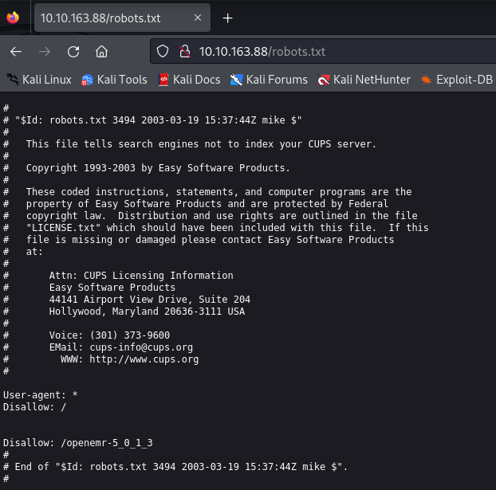
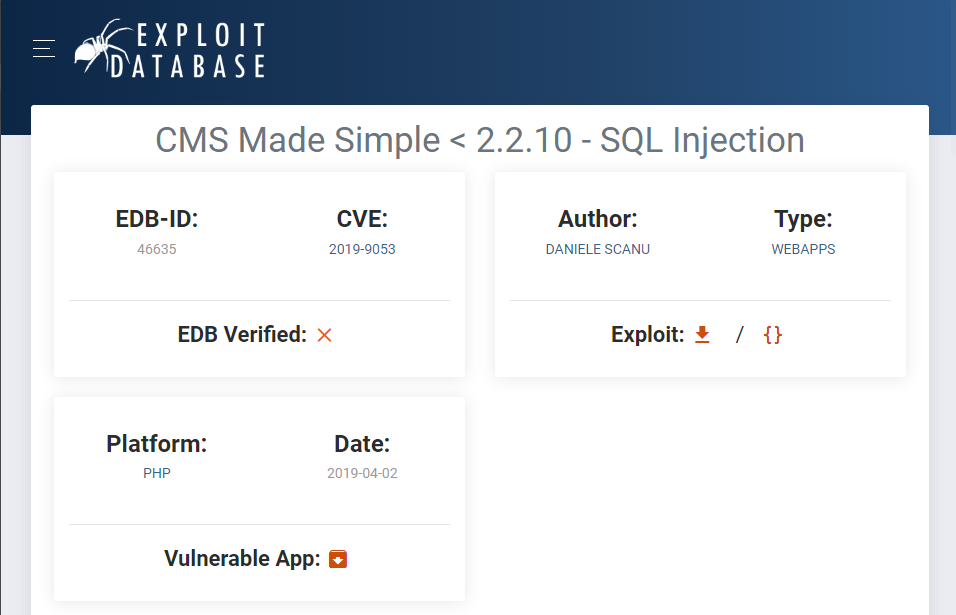
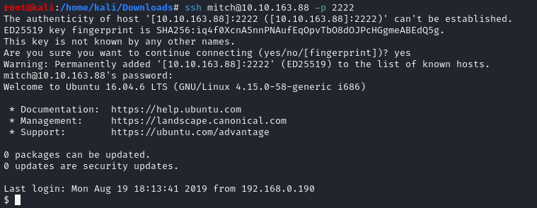
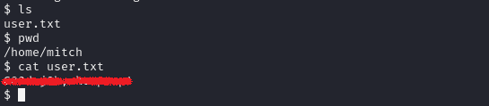
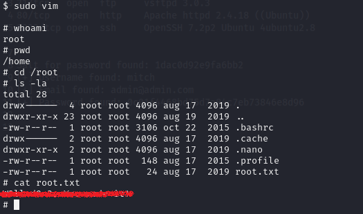

**Challenge description:** This challenge tests your knowledge of basic web enumeration techniques, exploiting Unauthenticated SQL Injection on CMS Made Simple (CVE-2019-9053), enumerating username and password through SQL Injection, modifying and using of custom exploitation scripts, and privilege escalation techniques. 

**Challenge category:** Web Exploitation - Exploit CVE-2019-9053 - Password Cracking - Privilege Escalation.

**Challenge link:** [Simple CTF](https://tryhackme.com/room/easyctf)

<br/>

# Information Gathering

## Nmap Scan

The first step for us here is to enumerate the running services on the target system before doing anything.

So to find the services exposed we need to enumerate the provided `Target_IP` using **Nmap**.


From the above output, we can find that ports **21**, **80**, **2222** are open. These are the well-known ports for FTP and HTTP services respectively. And for SSH service the default port is **22** but in this challenge, the author has used port **2222**.

<br/>

## Enumerating the FTP Server

From the **Nmap** scan results, we can see that the **FTP** server allows anonymous login. Anyway, when we access it, it just gives us error messages without any useful information.

<br/>

## Enumerating the Web Server

From the Nmap scan result we can see that the target system is running a web server on port **80**, so let's open our browser and take a look at the web app.


From the above snapshot, we can see that the home page is just the default page for the Apache2 web server. So, nothing is interesting on this page. However, we still have to enumerate the sub-directories and files of the website, so let's do so.

<br/>

## Directory Enumeration using Gobuster 

Well! As the home page looks empty, now it's a good idea to start enumerating the web app to find hidden sub-directories and files.

To enumerate sub-directories and files you can use tools like **dirbuster**, **dirb**, **gobuster**, or even **burpsuite** but for now, we will use **gobuster**.


Alright! We have found three sub-directories, so let's investigate them.

<br/>

### robots.txt file



Well! The found _robots.txt_ file has nothing useful for us. We tried to access the _"/openmr-5_0_1_3"_ directory but not found. 

<br/>

### Simple Directory


Nice! Now we can say that there's a real website hosted on the Apache web server. And the more interesting thing is that it's a Content Management System (CMS). CMSs are well-known for having vulnerable versions, the use of vulnerable plugins, and insecure code.

<br/>

### CMS Version Detection

Detecting the running version of the CMS is an important thing while we are enumerating the web application; As based on the running version, we are gonna search for well-known vulnerabilities, exploitation scripts, and CVEs.

So in our case the running version is CMS Made Simple `2.2.8`. We directly found the running version on the down section of the home page.


<br/>

# Task 1: How many services are running under port 1000?

From the above **Nmap** scan results, the answer is `2`.

<br/>

# Task 2: What is running on the higher port?

From the above **Nmap** scan results, the answer is `ssh`.

<br/>

# Task 3: What's the CVE you're using against the application?

Well! To search if there is a well-known CVE for a vulnerable service or application, we can simply use Google with the name of the service or the application and its version as it's important to narrow down our search results and also to get the right CVE.

For the current web application, we found the following results from Exploit-DB website.



So the answer is `CVE-2019-9053`.

<br/>

# Task 4: To what kind of vulnerability is the application vulnerable?

From the above snapshot from Exploit-DB, the application is vulnerable to SQL Injection vulnerability. So the answer is `sqli`.

<br/>

# CVE-2019-9053 Exploit

As we have successfully enumerated the web application, detected its running version, found a CVE we can use to exploit it with, it's time to exploit the vulnerable CMS. From Exploit-DB, we can also download the exploitation script. So let's download the script we are gonna use.

**Note:** Sometimes after downloading an exploitation script, it may not work directly with you; As it may require you to download other independencies or libraries to work correctly, so having basic knowledge of programming and the ability to modify public exploitation codes or scrpits is a beneficial skill you should master as a penetration tester.

Well! Now after downloading the script and modifying it, let's take a look at how it works.


Great! Looks like it's usage is simple. So let's run it with the following command:

```console
$ python 46635.py -u http://<room_IP>/simple
```


Superb! By exploiting the SQL Injection in the CMS, the exploitation script successfully retrieved the password salt, a valid username on the target system, an email address, and a password hash.

So now let's run the script again, but this time, let's enable the crack option to crack the password hash and use the wordlist provided from the challenge hint. To do so, we used the following command:

```console
$ python 46635.py -u http://<room_IP>/simple --crack -w /usr/share/seclists/Passwords/Common-Credentials/best110.txt
```


Great job! We got the password of user `mitch`.

<br/>

# Task 5: What's the password?

From the previous snapshot, the password is `secret`.

<br/>

# Task 6: Where can you login with the details obtained?

As we just have three services running on the target system, it's easy to try to login to them and figure out where can we login. So after doing so, we found that we were able to login with the obtained credentials in the `SSH` service.



<br/>

# Task 7: What's the user flag?

By listing the content of the current directory, we find the user.txt file and by reading it, we directly find the user flag.



<br/>

# Task 8: Is there any other user in the home directory? What's its name?

By listing the content of the `/home` directory, we can find that the name of the other user is `sunbath`.


<br/>

# Task 9: What can you leverage to spawn a privileged shell?

To know how to leverage a privileged shell, we tried different privilege escalation vectors and the one that worked was by listing the commands we can run on the system as root through the `sudo` command.


Well! We can run `vim` as root on the system. So we can leverage `vim` to spawn a privileged shell.

<br/>

## Leveraging vim to spawn a privileged shell

To spawn a privileged shell, we used the following commands:

```console
$ sudo vim
$ :!/bin/sh
```


Kudos! We are now the **root** user on the system.

<br/>

# Task 10: What's the root flag?

By listing the content of the `/root` directory and reading `root.txt`, we successfully retrieved the root flag.



<br/>

# Conclusion

In conclusion, I hope this walkthrough has been informative and shed light on our thought processes, strategies, and the techniques used to tackle each task. CTFs are not just about competition; they're about learning, challenging yourself and your knowledge, and getting hands-on experience through applying your theoretical knowledge.